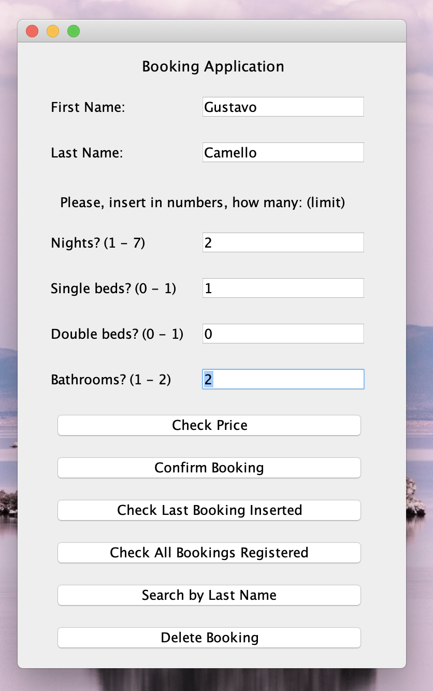
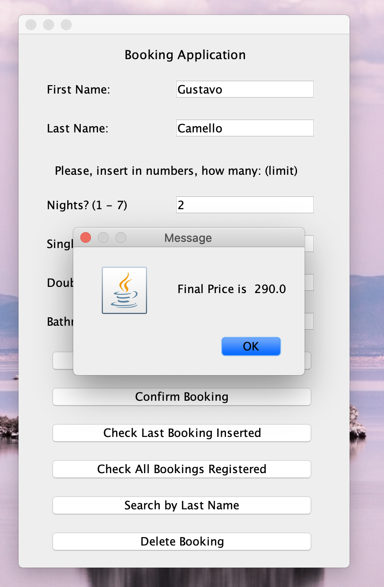

# Hotel Booking

## About the project

This application is the final project of the 2nd year of my Bachelor (Honours) Degree in Computing at NCI.
The application is developed with Java to demonstrate our skills in Object Oriented Programming.
It was a group project, developed by me (Gustavo Camello), Daniel Pinton e Douglas Mazotti.

The application itself, its a simple hotel booking, where you can check the prices for a booking,
basead in how many nights, number of bedrooms and bathrooms.

## Grade Achieved (0-100): 71.2

## Built with
- Java

## Contact

- Gustavo Camello - x18119956@student.ncirl.ie
- Daniel Pinton - X18159982@student.ncirl.ie
- Douglas Mazotti - X18151493@student.ncirl.ie

## Application's Images

